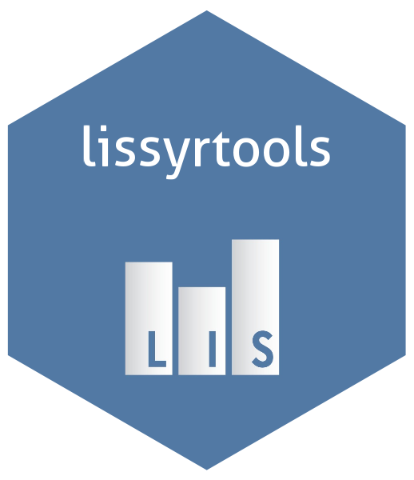

# lissyrtools <a href="https://www.lisdatacenter.org/"></a>


<!-- badges: start -->

[](https://github.com/LIS-Cross-National-Data-Center/lissyrtools) [](https://codecov.io/gh/LIS-Cross-National-Data-Center/lissyrtools) 

<!-- badges: end -->

## Overview

A package with the tools needed to develop scripts with LIS data

It allows users to:

\* Read LIS data within the LISSY environment, or to use LIS sample files locally.

\* Carry out commonly performed data cleaning tasks.

\* Compute estimates from microdata.

## Version

This package is currently in Beta version.

For questions and help, email usersupport(add)lisdatacenter.org

## Installation

The package is already installed in LISSY by the LIS Data Center team.

You can install the package locally to work with your own data or with the [LIS Sample Datasets](https://www.lisdatacenter.org/resources/self-teaching/) from this GitHub repo with:

``` r
devtools::install_github("https://github.com/LIS-Cross-National-Data-Center/lissyrtools")
```

## Usage

lissyrtools provides its users with a set of functions and embedded objects designed to help users access and manipulate data in LIS's remote execution system: [LISSY](https://www.lisdatacenter.org/data-access/lissy/). By providing built-in sample datasets in lissyrtools, we also encourage users to develop their LISSY scripts locally, where debugging and writing R code are more efficient in IDEs like RStudio.

Data first needs to be loaded using the [lissyuse()](https://lis-cross-national-data-center.github.io/lissyuse_2.0_doc/lissyuse_2.0_doc.html) function, which creates the list `lis_datasets` or `lws_datasets` if its argument `lws` == TRUE. Subsequently, the list can be transformed using other functions from **lissyrtools** in a pipeline structure, enabling users to generate aggregated figures for the entire dataset or specific subgroups.

### LISSY version

``` r
library(lissyrtools)
library(dplyr)

# Load the datasets 
lissyrtools::lissyuse(
  data = "ca", 
  vars = c("dhi", "pi11", "age"), 
  from = 2014, 
  to = 2019
  ) 
# This function creates the list `lis_datasets`

# Clean target variables:
## pi11
lissy_datasets_transformed <- lis_datasets %>%
  transform_false_zeros_to_na("pi11") %>%
  transform_negative_values_to_zero("pi11") %>%
  transform_zeros_to_na("pi11") %>%
  transform_top_code_with_iqr("pi11") %>%
  transform_bottom_code_with_iqr("pi11") %>%
  transform_adjust_by_lisppp("pi11") %>%
  transform_restrict_age("pi11", from = 16, to = 64)

## dhi
lissy_datasets_transformed <- lissy_datasets_transformed %>%
  transform_false_zeros_to_na("dhi") %>%
  transform_negative_values_to_zero("dhi") %>%
  transform_top_code_with_iqr("dhi") %>%
  transform_bottom_code_with_iqr("dhi") %>%
  transform_equivalise("dhi") %>%
  transform_adjust_by_lisppp("dhi")

# Compute indicators
print_indicator(lissy_datasets_transformed,
                             variable = "dhi",
                             indicator = "gini",
                             na.rm = TRUE)
                             
print_indicator(lissy_datasets_transformed,
                             variable = "pi11",
                             indicator = "gini",
                             na.rm = TRUE)


# To load LWS datasets, set the argument `lws` == TRUE:
lissyuse(
  data = c("us", "uk17", "uk19"), 
  vars = "dnw", 
  from = 2015, 
  to = 2021,
  lws = TRUE
)

# When working with LWS datasets, the list will be named lws_datasets
names(lws_datasets)
```

### Local version

When working with `lissyrtools` locally, use `lissyuse()`, along with the [sample files](https://www.lisdatacenter.org/resources/self-teaching/) made available in the package. For LIS we have the following, for LWS we have this other ones .....

``` r
lissyuse(data = c("it14", "us16", "mx18"), lws = FALSE)
                              
```

## Documentation and Support

Please visit <https://lis-cross-national-data-center.github.io/lissyrtools/> for documentation and vignettes with examples.

Dependencies references:

-   [magrittr](https://magrittr.tidyverse.org/);

-   [dplyr](https://dplyr.tidyverse.org/);

-   [purrr](https://purrr.tidyverse.org/)
