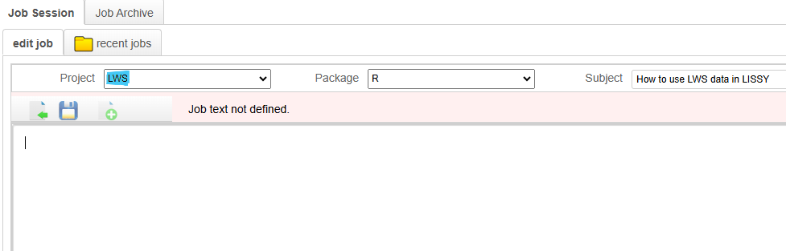

# lissyrtools <a href="https://lis-cross-national-data-center.github.io/lissyrtools/"></a>

<!-- badges: start -->

[](https://github.com/LIS-Cross-National-Data-Center/lissyrtools) [](https://codecov.io/gh/LIS-Cross-National-Data-Center/lissyrtools)

<!-- badges: end -->

## Overview

📦 Welcome to `lissyrtools`

An R package designed to simplify and streamline the use of LIS and LWS microdata. It provides a consistent workflow for exploring and visualizing a wide range of socioeconomic indicators—such as income, wealth, employment, education, housing, and demographics—across countries and over time.

💡 Key Features:

🌍 **Access harmonized global data** – Load over 1,000 datasets from 50+ country series worldwide in one step.

🔧 **Flexible data transformations** – Wrangle and transform your data with ease—supporting currency conversion, equivalization, and outlier detection.

🪄 **Effortless use of weights** – Fully integrated weight handling for all functions computing aggregated figures.

📊 **Instant insights** – Quickly grasp variable distributions, magnitudes, and subgroup breakdowns—within countries over time and across countries, all in one place.

📋 **Clean and readable outputs** – Results are printed in a compact, country-wise format that’s easy to interpret

📈 **Visual-ready data** – Convert outputs to tidy data frames—fully compatible with `ggplot2`—with a single function.

🔍 **Smart metadata tools** – Directly check dataset and variable availability, including labels, notes, and category definitions—no need to switch interfaces.

🖥️ **Local prototyping** – Build, test, and debug your code locally using built-in sample datasets, then run it on LISSY when ready.

🚀 Why use`lissyrtools`?

Because LIS/LWS data are rich—but handling them shouldn't be complex.

`lissyrtools` brings **clarity**, **structure**, and **speed** to your LIS data workflow—whether you’re a researcher, policymaker, student, or data scientist.

Focus on uncover insights—not wrangling data and debugging. Let `lissyrtools` handle the boilerplate !

## Installation

The package is already installed on [LISSY](https://www.lisdatacenter.org/data-access/lissy/).

To use it **locally with built-in** [LIS Sample Datasets](https://www.lisdatacenter.org/resources/self-teaching/), install it from GitHub:

``` r
# Pre-install dependencies 
required_packages <- c(
  "haven", "dplyr", "ggplot2", "stringr", "rlang", "glue", "magrittr", "purrr",
  "assertthat", "tibble", "readr", "matrixStats", "devtools"
)

install.packages(required_packages, repos = "https://cran.r-project.org")

# Install lissyrtools from its online repository 
devtools::install_github("https://github.com/LIS-Cross-National-Data-Center/lissyrtools")
```

## Usage

**lissyrtools** can be used both:

-   **Remotely on LISSY**, where it is already available;

-   **Locally**, where it supports the same syntax and offers built-in datasets for easier prototyping.

This makes it possible to write, test, and debug your code locally in tools like RStudio, then run it on LISSY when ready.

Data first needs to be loaded using the [lissyuse()](https://lis-cross-national-data-center.github.io/lissyrtools/reference/lissyuse.html) function. Its output will be a list whose elements are the datasets available in the LIS database for the countries selected within the specified time frame. LWS data can be loaded by setting the \`lws\` argument to TRUE (e.g lws = TRUE), with the Project dropdown adjusted to "LWS" as shown in the image below:



Subsequently, the list can be transformed using other functions from **lissyrtools** in a pipeline structure, enabling users to generate aggregated figures for the entire dataset or specific subgroups.

### LISSY version

##### Importing Data

``` r
library(lissyrtools)

lu_data_hhd <- lissyuse(
  data = "lu", 
  vars = "dhi", 
  from = 2014, 
  to = 2019
  )

print(names(lu_data_hhd)) # elements: `ccyy` data frames at h-level 
print(names(lu_data_hhd[[1]])) # Notice that some variables are loaded by default too.

# Selecting both h-level and p-level variables will automatically merge both files:

lu_data_p <- lissyuse(
  data = "lu", 
  vars = c("dhi", "age", "educ"), 
  from = 2014, 
  to = 2019
  )

print(names(lu_data_p))
print(names(lu_data_p[[1]]))
```

##### Transform each Data Frame

``` r
library(lissyrtools)
library(purrr)
library(dplyr)

lis_datasets <- lissyuse(
  data = c("ca", "de", "fr"), 
  vars = c("dhi", "age", "rural"), 
  from = 2014, 
  to = 2019
)

# `purrr:map()` function implements the same operation to each data frame on the list  
lis_datasets_hhd <- lis_datasets %>% 
  purrr::map(~ .x %>% 
               filter(!is.na(dhi)) %>%
               filter(relation == 1000) %>% # back to `h-level`
               mutate(new_wgt = hwgt * nhhmem))

# `apply_*()` functions implement transformations such as currency conversion, equivalization, and outlier detection

lis_datasets_ready <- lis_datasets_hhd %>% 
  apply_iqr_top_bottom_coding("dhi", "hwgt", times = 3) %>%  
  apply_sqrt_equivalisation("dhi") %>%  
  apply_ppp_adjustment("dhi", 
                       database = "lis",
                       transformation = "lisppp")
```

##### Compute Aggregate Figures

``` r
# Count of rural vs. urban households (unweighted)
res1 <- lis_datasets_ready %>% run_weighted_count("rural") 

# Mean disposable income by country (weighted)
res2 <- lis_datasets_ready %>% run_weighted_mean("dhi", "new_wgt")

# Mean disposable income by rural/urban (weighted)
res3 <- lis_datasets_ready %>% run_weighted_mean("dhi", "new_wgt", 
                                                 by = "rural")

# Diposable Income share across percentiles 
res4 <- lis_datasets_ready %>% run_weighted_percentiles("dhi", "new_wgt", 
                                                        probs = seq(0, 1, 0.2), share = TRUE)

print(res1)
print(res2)
print(res3)
print(res4)
```

##### Tidy Up Your Results and Make Plots Instantly

``` r
# `structure_to_plot()` function transforms list into a data frames   

library(lissyrtools)
library(ggplot2)
library(dplyr)

# Converts results to tidy format and prints a message with the new column names
data_to_plot <- res2 %>% structure_to_plot()


ggplot(data_to_plot, aes(x = year, y = value, color = cname, group = cname)) +
  geom_point() +
  geom_line() +
  labs(
    title = "dhi trend",
    caption = "Source: Luxembourg Income Study"
  ) +
  scale_y_continuous(labels = scales::comma) +
  theme_minimal() +
  theme(axis.text.x = element_text(angle = 25, hjust = 1))
```

##### LWS Data

``` r
library(lissyrtools)
library(dplyr)

# 1) Set the argument `lws` = TRUE
# 2) Change the Project dropdown in LISSY accordingly. 

lws_datasets <- lissyuse(
   data = c("us"), 
   vars = "dnw", 
   from = 2010, 
   to = 2020,
   lws = TRUE  
 ) 
 
# Inspect presence of implicates in each dataset (via the `inum` variable)
purrr::map(lws_datasets, ~unique(.x$inum)) %>% print()

# Compute mean net worth by implicate, then average across implicates
lws_datasets %>%
  run_weighted_mean("dnw", by = "inum") %>%
  purrr::map(~mean(.x))  # final average by dataset across implicates
```

### Local version

When working with `lissyrtools` locally, use `lissyuse()`, along with the [sample files](https://www.lisdatacenter.org/resources/self-teaching/) embedded in the package. These sample datasets include both household level and person level files for three LIS countries: Italy, Mexico and the United States - and two LWS countries: Italy and the United States.

##### Importing sample datasets

``` r
library(lissyrtools)
library(dplyr)


lis_datasets <- lissyuse(
  data = c("it", "us", "mx"), 
  vars = c("region_c", "dhi", "age", "pi11", "sex")
  )

names(lis_datasets)


lws_datasets <- lissyuse(
  data = c("it", "us"), 
  vars = c("region_c", "dnw"), 
  lws = TRUE
  )

names(lws_datasets)

# Afterwards, you can starting building your jobs locally, and run them in LISSY once ready !  
```

##### **Metadata functions**

``` r

# Get available countries for LIS and LWS datasets
get_countries_lis()
get_countries_lws()

# Get available years for selected countries
get_years_lis(iso2 = c("ca", "de", "fr"))
get_years_lws(iso2 = c("jp", "no", "za"))

# Print survey names
get_surveys_lis("ca")
get_surveys_lws("jp")


# Show the label of variable "educ"
variable_labels("educ")

# Alternatively: find all variables that have the "educ" pattern on their label
variable_labels()[stringr::str_detect(variable_labels(), "educ")]

# Check if a variable exists in selected countries
variable_exists("ethnic_c", iso2 = c("lu", "uk", "nl"))

# Did categories of "ethnic_c" changed over time in the Luxembourgish series ?

# 1) We can look to the number of categories for "ethnic_c" across the series
variable_country_specific_categories(
  var = "ethnic_c", 
  iso2 = "lu", 
  n_categories = TRUE
)

# 2) Let's now inspect the categories within a defined time range
variable_country_specific_categories(
  var = "ethnic_c", 
  iso2 = "lu", 
  from = 2014, 
  to = 2021
)

# Inspect if a variable has notes in METIS for a given country
variable_has_note("ethnic_c", "lu")
```

## User Support

If you encounter any bugs, typos, or experience any issue while running jobs including this packages' tools, please email us at: [usersupport\@lisdatacenter.org](mailto:usersupport@lisdatacenter.org).

For more information about LIS, visit our [website](https://www.lisdatacenter.org/), explore [METIS](https://www.lisdatacenter.org/frontend#/home) for metadata, and check out our best practices for [job submission in LISSY](https://www.lisdatacenter.org/data-access/lissy/syntax/).

Recommended checks on other packages that offer tools for data manipulation and list handling:

-   [purrr](https://purrr.tidyverse.org/)

-   [dplyr](https://dplyr.tidyverse.org/)
